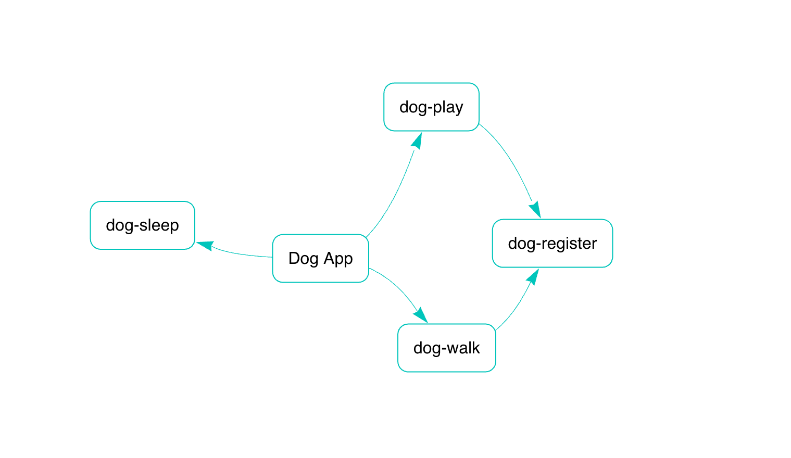

# Dog Mobile App Microservices

This project consists of multiple microservices for a Dog Mobile App. The services include `dog-sleep`, `dog-play`, `dog-walk`, and `dog-registration`. Each service is containerized using Docker and can be orchestrated using Docker Compose.


## Architecture

The architecture consists of the following services:

- **dog-sleep**: Manages the sleeping schedule of dogs.
- **dog-play**: Manages the play activities of dogs. It checks if a dog is registered before allowing it to play.
- **dog-walk**: Manages the walking activities of dogs. It checks if a dog is registered before allowing it to walk.
- **dog-registration**: Manages the registration of dogs.

Each service has its own PostgreSQL database.

## Services Overview

1. **Dog Sleep Service**
   - **Path:** `dog-sleep`
   - **Description:** Manages sleep-related actions for registered dogs.
   - **Entry Point:** `cmd/main.go`
   - **Handlers:** `internal/handlers/sleep.go`
   - **Business Logic:** `internal/services/sleep_service.go`
   - **Dockerfile:** `Dockerfile`

2. **Dog Play Service**
   - **Path:** `dog-play`
   - **Description:** Manages play-related actions for registered dogs.
   - **Entry Point:** `cmd/main.go`
   - **Handlers:** `internal/handlers/play.go`
   - **Business Logic:** `internal/services/play_service.go`
   - **Dockerfile:** `Dockerfile`

3. **Dog Walk Service**
   - **Path:** `dog-walk`
   - **Description:** Manages walk-related actions for registered dogs.
   - **Entry Point:** `cmd/main.go`
   - **Handlers:** `internal/handlers/walk.go`
   - **Business Logic:** `internal/services/walk_service.go`
   - **Dockerfile:** `Dockerfile`

4. **Dog Registration Service**
   - **Path:** `dog-registration`
   - **Description:** Handles the registration of dogs and manages their data.
   - **Entry Point:** `cmd/main.go`
   - **Handlers:** `internal/handlers/registration.go`
   - **Business Logic:** `internal/services/registration_service.go`
   - **Dockerfile:** `Dockerfile`

## Getting Started

### Prerequisites

- Go (version 1.16 or later)
- Docker
- Docker Compose

### Running the Services

1. Clone the repository:
   ```
   git clone <repository-url>
   cd dog-mobile-app
   ```

2. Build and run the services using Docker Compose:
   ```
   docker-compose up --build
   ```

3. Access the services at the following endpoints:
   - Dog Sleep Service: `http://localhost:<sleep-port>`
   - Dog Play Service: `http://localhost:<play-port>`
   - Dog Walk Service: `http://localhost:<walk-port>`
   - Dog Registration Service: `http://localhost:<registration-port>`

### Service Dependencies

Each service may depend on the dog-registration service to verify if a dog is registered before allowing play or walk actions.

## Contributing

Contributions are welcome! Please open an issue or submit a pull request for any improvements or bug fixes.

## License

This project is licensed under the MIT License. See the LICENSE file for details.